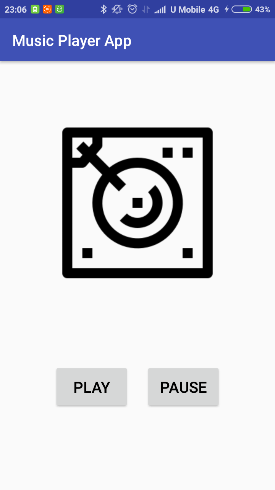

# Music Player App

  

## Getting Started

This mobile app plays a song which is pausible, which developed during [Udacity's Android Basics: Multiscreen Apps Course](https://www.udacity.com/course/android-basics-multiscreen-apps--ud839).

## Deployment

Tested on Android 6.0 mobile phone.

## Built With

[Android Studio 3.1.3](https://developer.android.com/studio/) 

## Versioning

[Semantic Versioning (SemVer) 2.0.0](http://semver.org/)

## Authors

**Jerry Chong** - [jerrychong25](https://github.com/jerrychong25)

## License

This project base code is originally provided by Udacity's Android Basics: Multiscreen Apps Course Course Leads Katherine Kuan and Jessica Lin.
