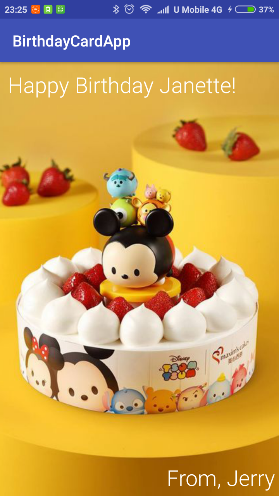

# Birthday Card App

  

## Getting Started

This is a mobile app that display Happy Birthday Card, which developed during [Udacity's Android Basics: User Interface Course](https://www.udacity.com/course/android-basics-user-interface--ud834).

## Deployment

Tested on Android 6.0 mobile phone.

## Built With

[Android Studio 3.1.3](https://developer.android.com/studio/) 

## Versioning

[Semantic Versioning (SemVer) 2.0.0](http://semver.org/)

## Authors

**Jerry Chong** - [jerrychong25](https://github.com/jerrychong25)

## License

This project is licensed under the MIT License - see the [LICENSE.md](LICENSE.md) file for details
