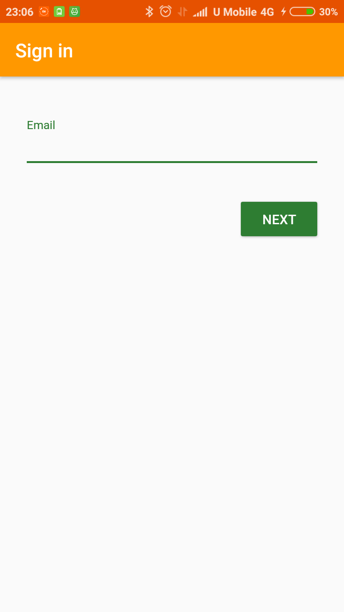
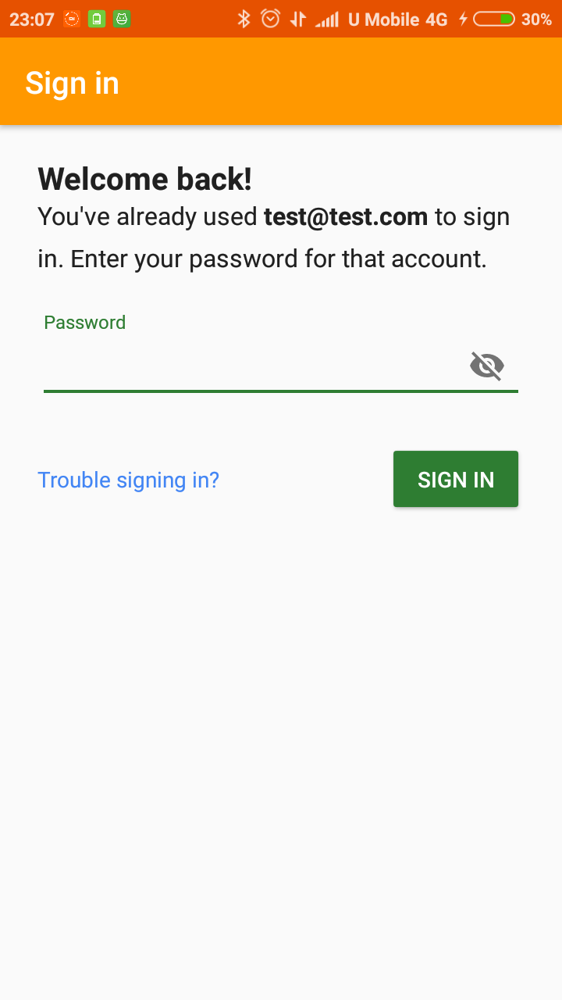
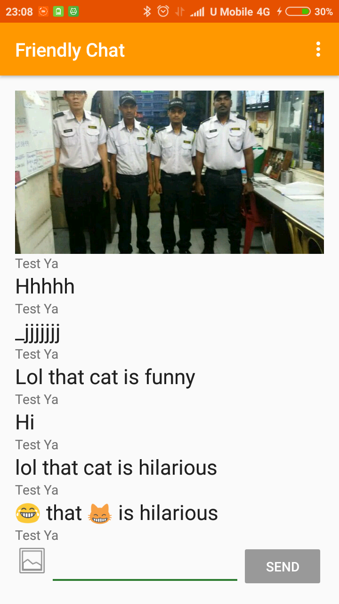

# Friendly Chat App

  
  
  
  

## Getting Started

This mobile app is a real time chat app that store and share data between different users in real time as well as authenticate and authorize those users, which developed during [Udacity's Firebase in a Weekend: Android by Google](https://www.udacity.com/course/firebase-in-a-weekend-by-google-android--ud0352).

## Deployment

Tested on Android 6.0 mobile phone.

## Built With

[Android Studio 3.1.3](https://developer.android.com/studio/) 

## Versioning

[Semantic Versioning (SemVer) 2.0.0](http://semver.org/)

## Authors

**Jerry Chong** - [jerrychong25](https://github.com/jerrychong25)

## License

This project base code is originally provided by Udacity's Firebase in a Weekend: Android by Google Course Leads Laurence Moroney, Frank van Puffelen, Lyla Fujiwara and Daniel Mai.
