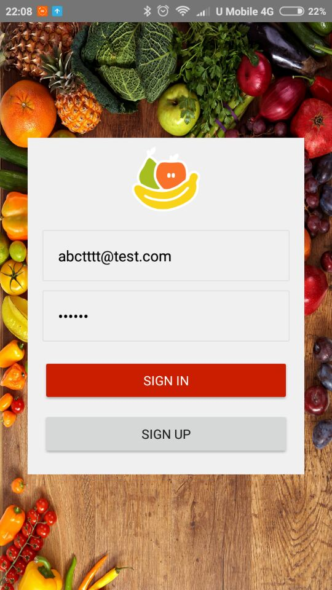
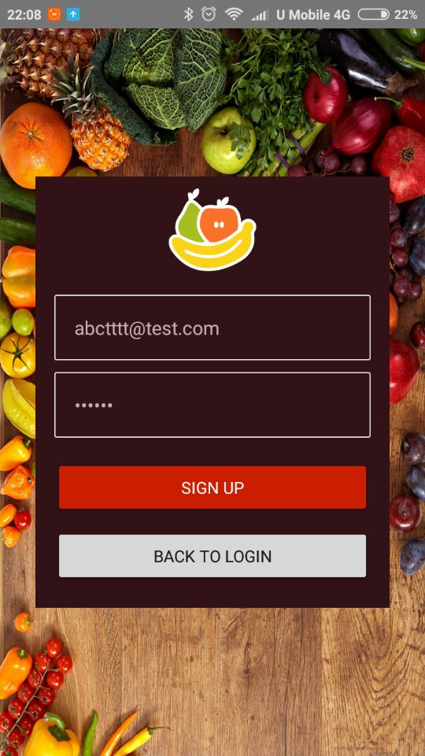
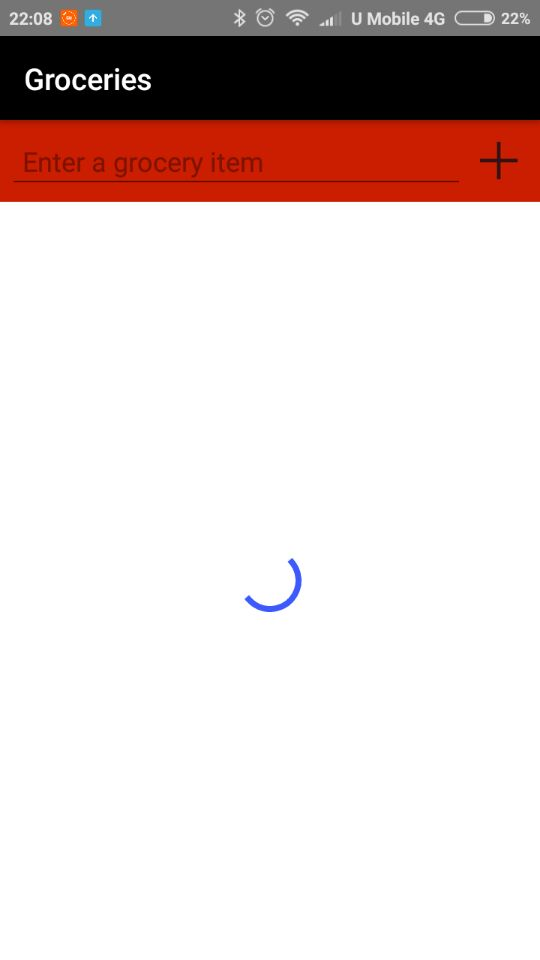
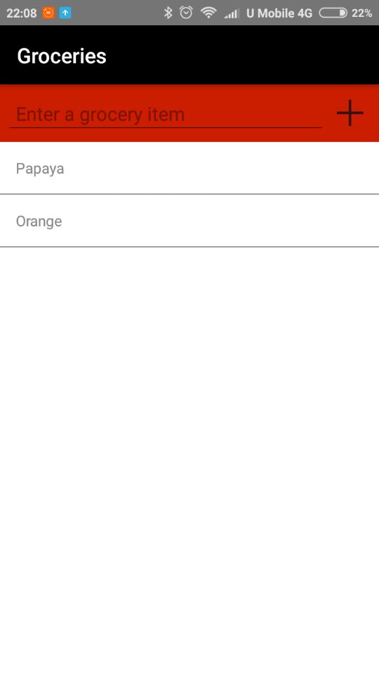

# Grocery App

  
  
  
  

## Getting Started

This mobile app display lists of grocery connected with [Progress® Kinvey™ host](https://www.progress.com/kinvey), which developed during [NativeScript's Tutorial](https://play.nativescript.org/).

## Deployment

Tested on Android 6.0 mobile phone.

## Built With

* [NativeScript Playground](https://play.nativescript.org/)

## Versioning

[Semantic Versioning (SemVer) 2.0.0](http://semver.org/)

## Authors

**Jerry Chong** - [jerrychong25](https://github.com/jerrychong25)

## License

This project base code is originally provided by NativeScript's Tutorial Team.
